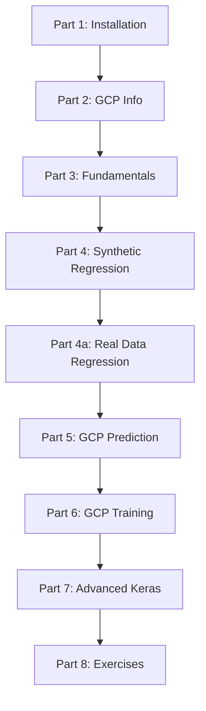

# 🚀 Help-in-starting-with-Tensorflow2.X

Welcome to the comprehensive guide for getting started with **TensorFlow 2.x**! This repository is designed to take you from installation to building and deploying machine learning models, including integration with Google Cloud Platform (GCP).

---

## 📋 Table of Contents

1.  [Project Overview](#-project-overview)
2.  [Learning Path](#-learning-path)
3.  [Installation & Setup](#-installation--setup)
4.  [Notebooks Summary](#-notebooks-summary)
5.  [New Advanced Topics](#-new-advanced-topics)
6.  [Exercises & Challenges](#-exercises--challenges)
7.  [Resources & Documentation](#-resources--documentation)

---

## 🏗 Project Overview

This repository serves as a tutorial series for beginners and intermediate users. It covers:
-   **Basics:** Tensors, Variables, and Operations.
-   **Regression:** Linear regression with synthetic and real-world datasets.
-   **Cloud Integration:** Using Google Cloud Platform (GCP) for prediction and training.
-   **Modern TF Features:** Keras Functional API, Model Subclassing, and more.

### 🗺 Learning Path



---

## ⚙️ Installation & Setup

To get started, we recommend creating a virtual environment to keep your dependencies isolated.

1.  **Create a Virtual Environment:**
    ```bash
    python -m venv venv
    source venv/bin/activate  # On Windows: venv\Scripts\activate
    ```

2.  **Upgrade Pip:**
    ```bash
    pip install -U pip
    ```

3.  **Install Dependencies:**
    ```bash
    pip install -r requirements.txt
    ```

---

## 📓 Notebooks Summary

| Part | Title | Description |
| :--- | :--- | :--- |
| 1 | [Installation](Part_1_instalation.ipynb) | Environment setup and version checking. |
| 2 | [GCP Info](Part_2_Google%20Cloud%20Platform%20with%20Tensorflow%202_information.ipynb) | Links and info for Google Cloud Platform setup. |
| 3 | [Fundamentals](Part_3_Constants_variables_tensors_and_strings.ipynb) | Constants, Variables, Tensors, and Strings. |
| 4 | [Synthetic Regression](Part_4_Linear_Regression_with_synthetic_data.ipynb) | Linear regression basics with generated data. |
| 4a | [Real Data Regression](Part_4a_linear_regression_with_real_data.ipynb) | California Housing dataset analysis and modeling. |
| 5 | [GCP Prediction](Part_5_Working_with_GPC_for_prediction.ipynb) | Serving models and making predictions on GCP. |
| 6 | [GCP Training](Part_6_Training_with_GCP.ipynb) | Overview of training models in the cloud. |
| 7 | [Advanced Keras](Part_7_Keras_Functional_API_and_Model_Subclassing.ipynb) | **NEW:** Functional API and Model Subclassing. |
| 8 | [Exercises](Part_8_Exercises.ipynb) | **NEW:** Coding challenges to test your knowledge. |

---

## 🌟 New Content

### 🧬 Keras Functional API vs Sequential
While the `Sequential` API is great for simple stacks of layers, the **Functional API** allows for complex topologies (multiple inputs/outputs, shared layers, etc.).

| Feature | Sequential API | Functional API | Model Subclassing |
| :--- | :--- | :--- | :--- |
| **Ease of Use** | Highest | Medium | Low |
| **Flexibility** | Low | High | Very High |
| **Debugging** | Easy | Easy | Hard |

### 🛠 Model Subclassing
For ultimate control, you can subclass `tf.keras.Model`. This is useful for research and custom logic that doesn't fit into a standard graph.

---

## 📚 Resources & Documentation
-   [Official TensorFlow Documentation](https://www.tensorflow.org/guide)
-   [TensorFlow YouTube Channel](https://www.youtube.com/tensorflow)
-   [Google ML Crash Course](https://developers.google.com/machine-learning/crash-course)

---
*Maintained by Artur Z. &hearts; (Refreshed 2024)*
